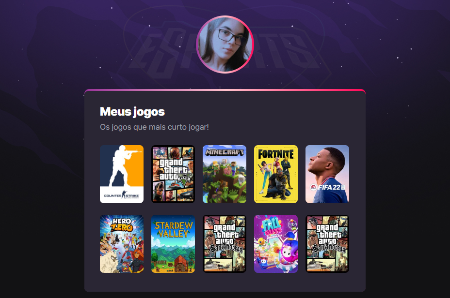
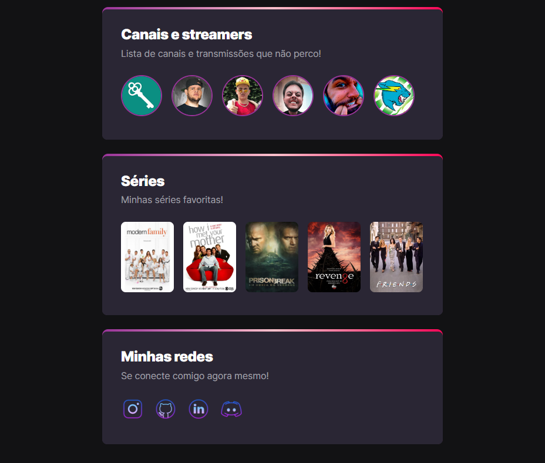

# NLW eSports - Trilha Explorer 👩‍💻🎮

> ⛓ Trilha Explorer 

Projeto feito no evento Next Level Week, disponibilizado pela Rocketseat 🚀
Mentoria: Mayk Brito.

[🔗 Clique aqui para acessar](https://ketillyqueiroz.github.io/NLW-eSports)

## Tecnologias 🧩

-> HTML5.
-> CSS3.
-> Git e Github.

## Contato 📲

Instagram: @ketilly.keyce
Gmail: ketillyunicsul@gmail.com
